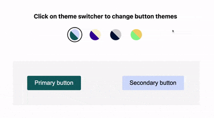

# React theming using styled-components and Context API



### Multiple theme support

```jsx
const themes: IThemes = {
  kabutar: {
    name: "kabutar",
    primary: {
      text: "white",
      main: "#0b525b",
    },
    secondary: {
      text: "black",
      main: "#cddafd",
    },
  },
  jhirki: {
    name: "jhirki",
    primary: {
      text: "white",
      main: "#390099",
    },
    secondary: {
      text: "black",
      main: "#faf0ca",
    },
  },
};
```

You can extend theme structure according to your requirements

### Easy to use Theme Provider

```javascript
import { useState } from "react";
import { ThemeProvider as StyledComponentThemeProvider } from "styled-components";
import { IThemeProviderProps } from "../ts/themes/theme-provider";
import themes from "./themes";
import { IThemesNames } from "../ts/themes/themes.types";
import ThemeSwitcher from "./theme-swicther-context";

export const DEFAULT_THEME: IThemesNames = "kabutar";

/**
 * Theme provider, Combination of styled-component ThemeProvider and
 * custom context provider to update the theme
 * @param props
 * @returns
 */
export default function ThemeProvider(props: IThemeProviderProps) {
  const [themeName, setTheme] = useState < IThemesNames > DEFAULT_THEME;
  return (
    <StyledComponentThemeProvider theme={themes[themeName]}>
      <ThemeSwitcher.Provider value={{ setTheme }}>
        {props.children} // your app here
      </ThemeSwitcher.Provider>
    </StyledComponentThemeProvider>
  );
}
```

### Switch theme from anywhere in the app using `ThemeSwitcher` Context;

Theme switcher eg.

```javascript
import React, { useContext } from "react";
import themes from "../../themes/themes";
import styled, { ThemeContext } from "styled-components";
import ThemeSwitcherContext from "../../themes/theme-swicther-context";
import { IThemesNames } from "../../ts/themes/themes.types";

const Themes = styled.div`
  display: flex;
  gap: 1.5rem;
`;
const ThemeSelector = styled.button`
  background-color: ${(props) => props.style?.backgroundColor};
  border-radius: 50%;
  height: 3rem;
  width: 3rem;
  cursor: pointer;
  display: inline-block;
  border: none;
`;
const ThemeSelectorContainer = styled.div`
  padding: 0.5rem;
  border-radius: 50%;
  height: 4rem;
  width: 4rem;
  display: flex;
  justify-content: center;
  align-items: center;
`;

/**
 * Theme switcher to switch between themes
 * @returns
 */
export default function ThemeSwicther() {
  // Theme setter from Custom context
  const { setTheme } = useContext(ThemeSwitcherContext);

  // current applied Theme from styled-component style context
  const theme = useContext(ThemeContext);

  return (
    <Themes>
      {Object.keys(themes).map((themeName) => {
        const primary = themes[themeName as IThemesNames].primary.main;
        const secondary = themes[themeName as IThemesNames].secondary.main;
        return (
          <ThemeSelectorContainer
            style={{
              border: theme.name === themeName ? "2px solid black" : "none",
            }}
          >
            <ThemeSelector
              style={{
                background: `linear-gradient(45deg,
            ${primary} 0 50%,  ${secondary} 50%) `,
              }}
              onClick={() => setTheme(themeName as IThemesNames)}
            />
          </ThemeSelectorContainer>
        );
      })}
    </Themes>
  );
}

```
